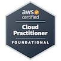
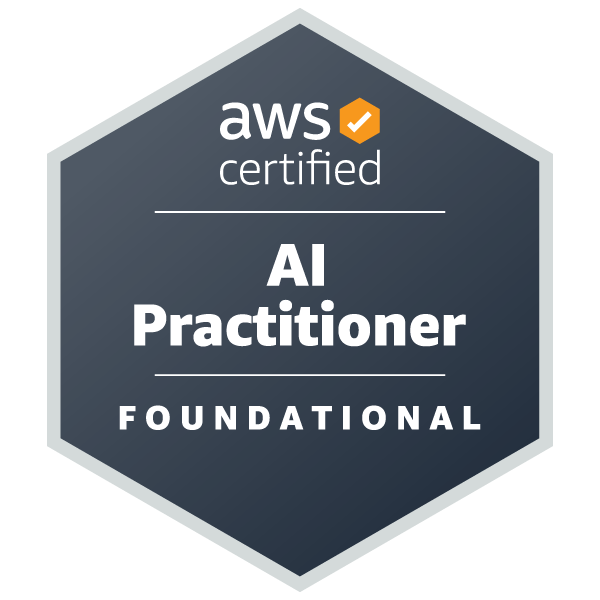
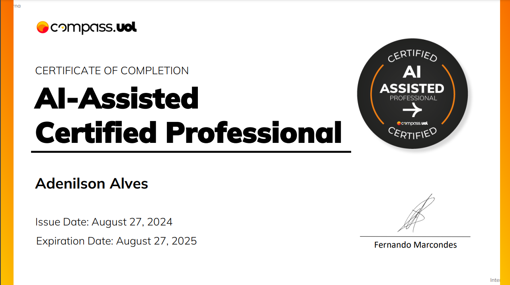

### Olá! Eu sou o Adenilson Konzelmann <Dê> 🤓

Formado em Engenharia de Software na [Unicesumar](https://www.unicesumar.edu.br/).

Atuo como Trainee DevOps na empresa [Compass UOL](https://compass.uol/en/home/), aprendendo a desenvolver soluções em nuvem resilientes, seguras e disponíveis, utilizando boas práticas de arquitetura e tecnologias de DevOps. 

- Práticas que tenho contato no meu dia a dia como trainee DevOps :
  - Pipelines de CICD com GCP CloudBuild
  - Configuração e Manutenção de ambiente kubernetes com GKE (Kubernetes gerenciado do GCP)
  - Versionamento com Git (gitflow e gitOps) e BitBucket 
  - Observabilidade com Prometheus e Grafana
  - ServiceMesh com Istio
  - Além das boas práticas da cultura DevOps

#
### Tecnologias que uso e/ou _estudo_ no meu dia a dia como trainee Devops:

	 	                     

#

   
#
### Certificações

  
  
  
    

#
## Projetos abaixo ⤵⤵

