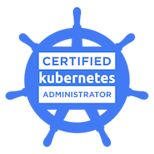
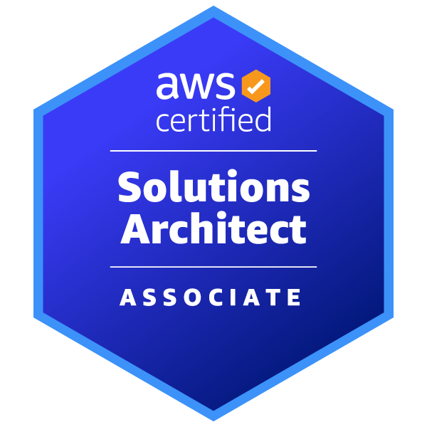
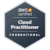
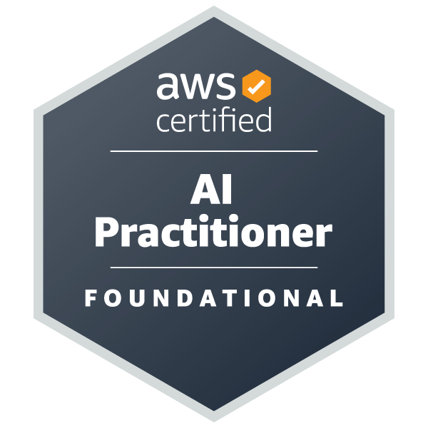
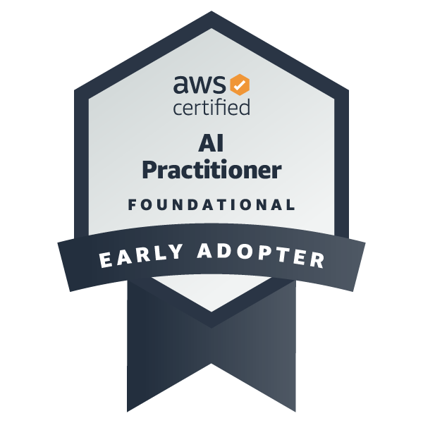
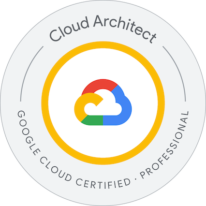
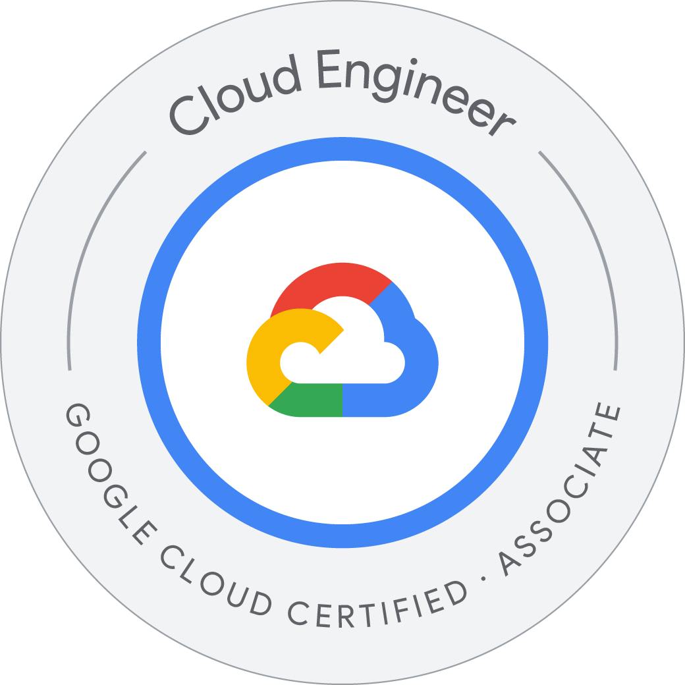

# Olá! Eu sou o Dê 👋

### DevOps | Kubernetes | AWS | GCP | Terraform | GitOps | Observabilidade

Sou formado em **Engenharia de Software** e atuo com **DevOps e sustentação de ambientes Cloud Native**, com experiência em Kubernetes, Linux, Cloud, Infraestrutura como Código, CI/CD e Observabilidade.

Atualmente trabalho na **Compass UOL**, atuando em ambientes multicloud e on-premises, com foco em troubleshooting, resolução de incidentes, análise de causa-raiz, mudanças em produção e evolução de ambientes.

Também desenvolvo projetos e laboratórios voltados a **Kubernetes, AWS, GCP, Terraform, GitOps, automação e arquitetura Cloud Native**.

---

## 👨‍💻 Sobre mim

Minha trajetória em tecnologia começou por meio de um programa de formação em **DevSecOps**. Desde então, venho aprofundando conhecimentos e aplicando na prática tecnologias e conceitos relacionados a infraestrutura, Cloud Native e automação.

No dia a dia, tenho contato principalmente com:

- ☸️ Administração e troubleshooting de ambientes **Kubernetes**, incluindo cenários multi-cluster.
- 🐧 Troubleshooting e administração de ambientes **Linux**.
- ☁️ Ambientes **AWS e GCP**, além de infraestrutura on-premises.
- 🏗️ Infraestrutura como Código utilizando **Terraform**.
- 🔄 Sustentação e evolução de pipelines **CI/CD**.
- 🚀 Estratégias de entrega utilizando **GitOps, Argo CD e Helm**.
- 📊 Observabilidade utilizando **Prometheus, Grafana, Loki, Tempo, OpenTelemetry e Datadog**.
- 🔐 Hardening de servidores, containers e aplicações, além de tratamento de vulnerabilidades e CVEs.
- 🚨 Atuação em incidentes críticos, troubleshooting, análise de causa-raiz e postmortems.
- ⚙️ Automação utilizando **Shell Script e Ansible**.

Tenho especial interesse em **Kubernetes, Cloud, IaC, Platform Engineering, Observabilidade, GitOps, Linux e automação aplicada a ambientes de produção**.

---

# 🛠️ Stack

### ☁️ Cloud & Infrastructure

### ☸️ Containers & Kubernetes

### 🔄 CI/CD & Git

**Práticas:** GitFlow • GitOps • CI/CD • Infrastructure as Code

### 📊 Observabilidade

### ⚙️ Automação

---

# 🏅 Certificações

  
  
  
  
  
  
  

- **Certified Kubernetes Administrator — CKA**
- **AWS Certified Solutions Architect – Associate**
- **Google Cloud Professional Cloud Architect — PCA**
- **Google Cloud Associate Cloud Engineer — ACE**
- **AWS Certified Cloud Practitioner**
- **AWS Certified AI Practitioner**

---

# 🚀 Projetos em destaque

Os projetos abaixo simulam cenários próximos aos encontrados em ambientes reais, abordando arquitetura, automação, segurança, disponibilidade, observabilidade e operação.

### ☸️ Kubernetes HA — On-Premises

Cluster Kubernetes altamente disponível provisionado e configurado utilizando **Ansible**, com arquitetura baseada em **stacked etcd**, múltiplos Control Planes e balanceamento/failover.

**Stack:**

`Kubernetes` `Ansible` `HAProxy` `Keepalived` `Linux` `etcd`

🔗 [Ver projeto](https://github.com/Adenilson365/kubeadm)

---

### 🏗️ Terraform + AWS + EKS

Provisionamento de uma infraestrutura AWS utilizando **Terraform**, organizada em módulos e ambientes distintos.

O projeto inclui EKS, redes privadas, IAM, AWS Organizations, políticas de segurança, Remote State e automação de infraestrutura utilizando **GitHub Actions**.

**Stack:**

`Terraform` `AWS` `EKS` `GitHub Actions` `IAM` `Organizations` `SCP` `Networking`

🔗 [Ver projeto](https://github.com/Adenilson365/tf-labs01-aws-k8s)

---

### 🚀 GitOps Multi-Cluster com Argo CD

Implementação de uma estratégia GitOps utilizando **Argo CD** em ambiente Kubernetes multi-cluster.

O projeto utiliza o padrão **App of Apps**, separação entre aplicações, componentes compartilhados e infraestrutura, além de integração com GitHub Actions.

**Stack:**

`Kubernetes` `Argo CD` `GitOps` `App of Apps` `GitHub Actions` `Helm`

🔗 [Ver projeto](https://github.com/Adenilson365/argocd-lab)

---

### ☁️ Migração On-Premises → AWS

Laboratório simulando a migração de uma aplicação de três camadas para AWS, incluindo aplicação, filesystem e banco de dados.

A arquitetura utiliza conectividade privada e mecanismos de replicação para reduzir o downtime durante o cutover, incluindo estratégia de validação e rollback.

**Stack:**

`AWS` `EC2` `ALB` `Auto Scaling` `RDS` `EFS` `DMS` `DataSync` `VPN` `DNS`

🔗 [Ver projeto](https://github.com/Adenilson365/aws-migration-wordpress)

---

### 📊 Observabilidade em Kubernetes

Implementação de uma stack de observabilidade cobrindo **métricas, logs e traces**, além de dashboards e alertas para aplicações executadas em Kubernetes.

**Stack:**

`Kubernetes` `Prometheus` `Grafana` `Loki` `Tempo` `OpenTelemetry` `Alertmanager`

🔗 [Ver projeto](https://github.com/Adenilson365/devopslabs02-observabilidade)

---

## 🔎 Outros projetos

No meu [portfólio](https://knz.dev.br/) também estão disponíveis projetos envolvendo:

- Gerenciamento **multi-cluster Kubernetes com Rancher**.
- Gerenciamento de secrets utilizando **External Secrets Operator (ESO)**.
- Integração com **AWS Secrets Manager / GCP Secret Manager**.
- Kubernetes com **Affinity e Topology Spread Constraints**.
- Infraestrutura na **GCP utilizando Terraform**.
- Segurança, IAM, RBAC e Workload Identity.
- DNS, TLS, Ingress e Cert-Manager.

👉 **[Confira todos os projetos no meu portfólio](https://knz.dev.br/)**

---

## 🎓 Formação

**Engenharia de Software — UniCesumar**  
2021 — 2024

**Formação DevOpsPro — Fabrício Veronez**  
2024 — Atual

---

## 📫 Contato

🌐 **Portfólio:** [knz.dev.br](https://knz.dev.br/)  
💼 **LinkedIn:** [linkedin.com/in/adenilson-konzelmann](https://www.linkedin.com/in/adenilson-konzelmann/)  
💻 **GitHub:** [github.com/Adenilson365](https://github.com/Adenilson365)  
📧 **E-mail:** contato@knz.dev.br
